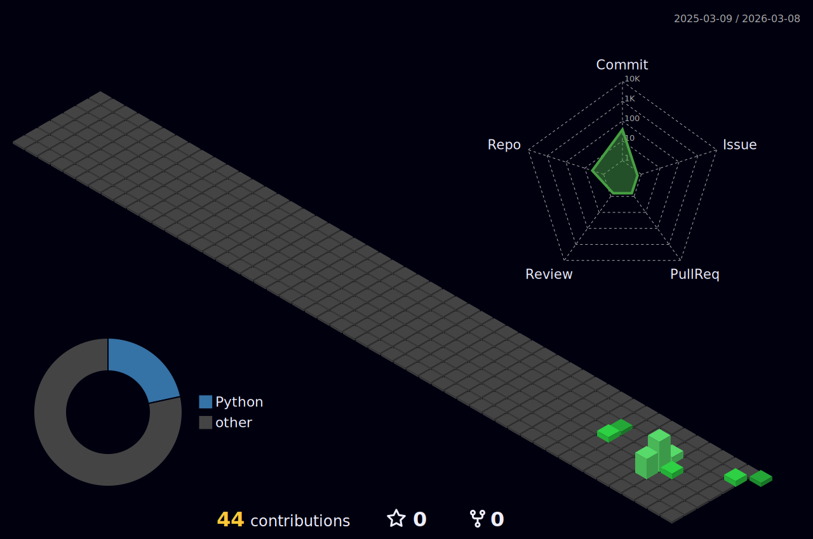

# 📟 console.log("Hello, World!");

  

---

### 🛠️ The Terminal (Who I Am)
I am an undergraduate student fascinated by the intersection of **AI Agents** and daily automation. While others go deep into LLM training, I focus on the **orchestration**—building systems that *do* things.

- 🤖 **Current Focus:** Developing a custom AI assistant to manage my life (reminders, schedules, and even birthday wishes).
- ⚡ **Philosophy:** Hop on new tech fast, build faster.
- 📺 **Off-duty:** Catching up on the latest Anime or exploring new frameworks.

---

### 🧪 System Requirements (Skills & Tools)

**`Languages & Frameworks`**
 

**`Installing Next...` (Learning Path)**
 
 

---

### 📊 System Stats

---

### 📡 Connection Ports
Ready to talk about Agents, Cloud, or Anime? 

---

  

